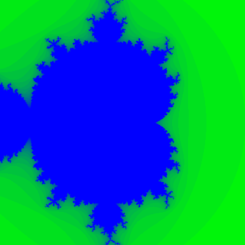
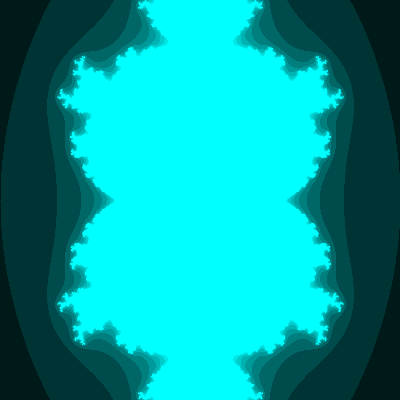
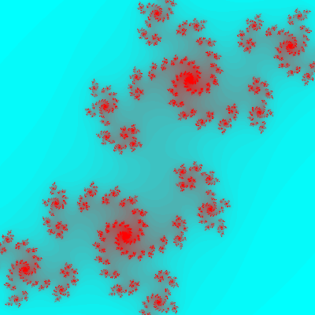

Fractals in Scheme
==================

Common fractals programmed in Chicken Scheme.

  * Mandelbrot sets
	* Program 1 draws the fractal in black and white
	* Program 2 draws a colorized fractal
	* Program 3 draws and animates the higher order Mandelbrot sets
  * Julia sets

Most fractals will require the numbers library: chicken-install numbers
The graphical demos require ezxdisp: chicken-install ezxdisp

To compile and execute: csc julia.scm && ./julia

